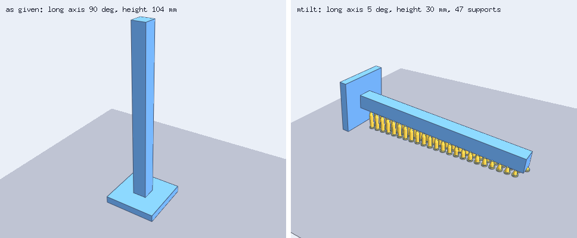
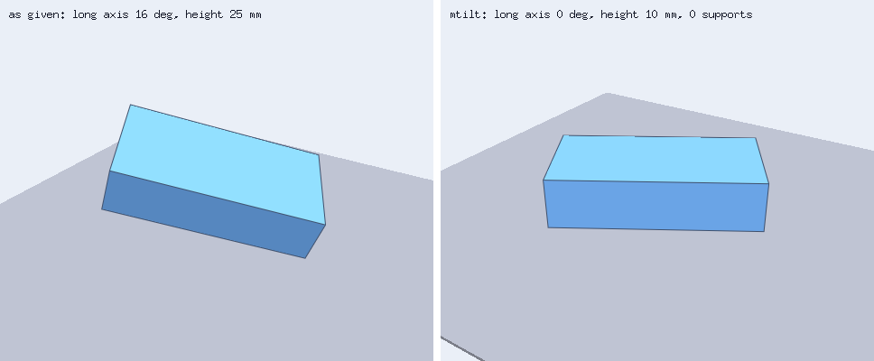
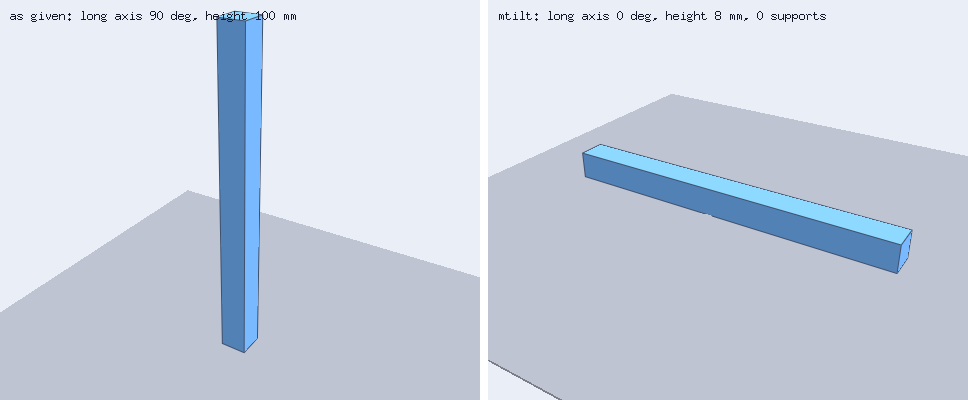
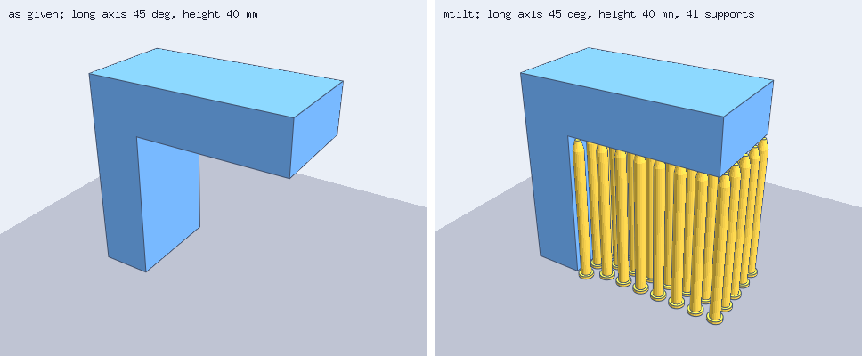
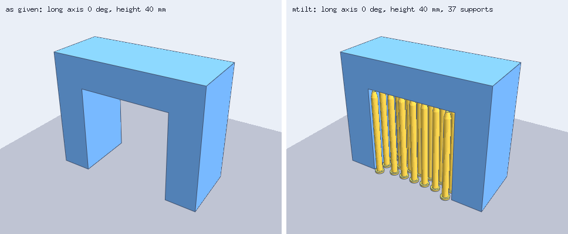

# mtilt

Automatic orientation and breakaway support generation for FDM printing of [decad](https://github.com/lestrrat-3d/decad)
bodies.

mtilt (mesh-tilt) takes a solid `*decad.Body`, picks an orientation for printing on a single-material FDM printer,
and builds separate support pillars as decad bodies in the same document: round pillars standing on the build
plate under the part's overhangs. You export the moved model and the supports with decad's exporters and import
them into a slicer.

> **Prototype.** The API, the report layout and the algorithms will change. Every support layout mtilt builds has
> passed mtilt's and decad's geometric checks and nothing else. No support from mtilt has been printed, sliced or
> tested for breakaway behavior. The example profile is illustrative and uncalibrated.

## What it looks like

Each image shows a test part as given (left) and as mtilt prepared it (right): the model in blue, the supports in
gold, on the build plate. `cd _gallery && go run .` regenerates them.

The nail stands 104 mm tall on a small flange. Standing up, every layer line crosses its length, so mtilt lays it
down; within the 15 degree tilt limit, a 5 degree tilt needs the fewest supports (47).



The oblique cuboid is turned onto its largest face and needs no supports.



The square stick is laid down.



The bracket and the bridge are kept upright (`KeepOrientation`) to show the pillars under an overhang and under a
span: 41 and 37 pillars.





## What it does now

- Takes one connected solid decad body (millimeters, +Z up, plate at Z = 0). It refuses a body that is not a
  solid or has more than one lump.
- Tessellates the body with decad (chord tolerance 0.01 mm by default) and plans on that mesh. The planning adds
  decad's proven tessellation bound to every gap and clearance it checks.
- Puts strength first. FDM parts are weakest across layer lines, so for a part with a long axis, mtilt never picks
  an orientation that tilts that axis more than 15 degrees (`MaxLongAxisTiltDeg`) from the plate.
- Searches inside that limit for the orientation with the least support. It estimates support volume and contact
  area for about 2,000 directions spread over the sphere plus every large flat face put down, refines the 8 best,
  plans real supports for each, and keeps the one whose planned pillars cost least. A direction must also leave at
  least `min_first_layer_area_mm2` on the first layer, so the part does not balance on an edge. Each pillar is a base
  disc, a shaft and a tip that narrows to a small contact, and stops `top_contact_gap_mm` below the surface it
  holds.
- Leaves short spans between two walls unsupported (up to `max_bridge_mm`, 10 mm in the example profile), because
  the printer draws them in the air, and leaves points that sit on top of a wall to that wall.
- For the selected candidate only, adds the moved model (`PlacedCopy`; the input stays live) and one revolved
  pillar body per support to the input's document. It then runs decad's `Verify`, requires that none of these
  bodies interfere and that each is a valid solid, and re-checks the pillars on their tessellations.
- Fails with a reason, and adds no bodies, when no candidate can be supported. An overhang above another part of
  the model is one such case, because no pillar rooted on the plate can reach it.

The full scope, algorithms and limits are in [docs/design.md](docs/design.md). Planned work is in
[docs/roadmap.md](docs/roadmap.md).

## Usage

```
go get github.com/lestrrat-3d/mtilt
```

mtilt needs Go 1.26.8 or later, and no C compiler.

The executable examples are the usage documentation; `go test ./examples/` runs them and checks their output.

- [`examples/mtilt_prepare_example_test.go`](examples/mtilt_prepare_example_test.go) builds a Γ-shaped bracket,
  keeps it upright so its arm needs 41 pillars, and writes the model and every pillar as STL with
  `decad/export`.
- [`examples/mtilt_strength_example_test.go`](examples/mtilt_strength_example_test.go) gives mtilt a round rod
  standing on its end and shows it laid down, because standing breaks the tilt limit.

`mtilt.Prepare` returns a `Result` with the moved model, the support bodies, the rigid transform, and a `Report`
that encodes to JSON. The report records the input's readings, the transform and its inverse, the effective
profile, every candidate's metrics, score terms and support outcome, the selected candidate, each support's
position, every validation check, the properties mtilt did not check, warnings, and whether a search limit was
reached. `mtilt.Analyze` runs the same search without planning supports or adding bodies.

## Importing into a slicer

mtilt has not been tested with any slicer. To keep the parts where mtilt put them:

1. Export the model and every support (for example with `decad/export.STL` or `decad/export.ThreeMF`) and import
   them together, as parts of one object, so the slicer keeps their relative positions instead of centering or
   dropping each file on the plate by itself. How to do that differs between slicers.
2. Check that the pillars sit under the overhangs, with a visible gap between each pillar's top and the part.
3. Turn off the slicer's own support generation for this object.
4. Inspect the sliced preview layer by layer: the top gap, the pillar tips and the bases.

[docs/validation.md](docs/validation.md) has the full procedure, including a small calibration print.

## Development

```
go test ./...                          # unit, pipeline and example tests
go vet ./...
golangci-lint run                      # v2.12.2, config in .golangci.yml
cd _gallery && go run .                # regenerate docs/images
```

## License

[PolyForm Noncommercial 1.0.0](LICENSE).
